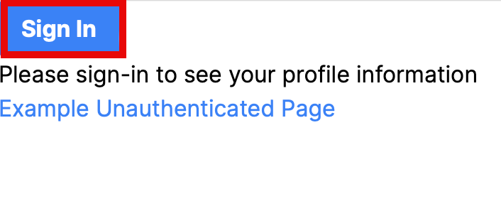
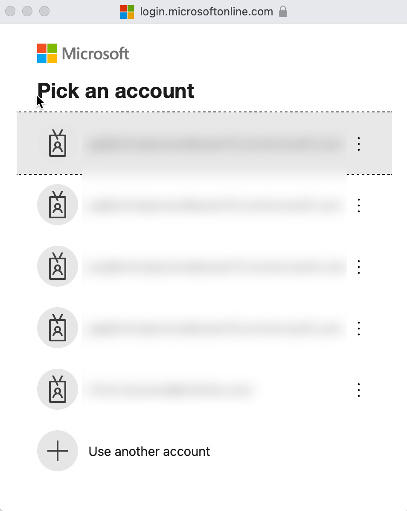

# Enable your Next.js Single-Page Application (SPA) to sign-in users and call APIs with the Microsoft identity platform
A sample to demonstrate the fundamentals of modern authentication with Microsoft identity platform in Next.js using MSAL React.

The [Microsoft identity platform](https://docs.microsoft.com/azure/active-directory/develop/v2-overview), incorporating [Entra ID](https://learn.microsoft.com/en-au/entra/fundamentals/whatis) (Azure AD) and [Azure Azure Active Directory B2C](https://docs.microsoft.com/azure/active-directory-b2c/overview) (Azure AD B2C) plays a pivotal role in the Azure cloud ecosystem.
This example is designed to showcase the basics of modern authentication within a Next.js framework, utilising the [Microsoft Authentication Library for React](https://github.com/AzureAD/microsoft-authentication-library-for-js/tree/dev/lib/msal-react) (MSAL React).

Next.js is an open-source React front-end development framework that enables developers to build server-side rendering and static web applications. It's known for its features like automatic code splitting, optimized performance, and simple page-based routing system, as well as for supporting static site generation (SSG), server-side rendering (SSR), and incremental static regeneration (ISR), making it a versatile choice for developing highly efficient and scalable web applications.

## Sample Prerequisites

- [Node.js](https://nodejs.org/en/download/)
- [Next.js v14.1.0+](https://nextjs.org/docs/getting-started/installation)
- [Visual Studio Code](https://code.visualstudio.com/download)
- A modern web browser

## Recommendations

- [Next.js by Vercel](https://nextjs.org/docs) framework documentation
- [SWR by Vercel](https://swr.vercel.app) React Hooks for Data Fetching
- [jwt.ms](https://jwt.ms) for inspecting your tokens
- [SPA developers: Migrate implicit to auth code flow with PKCE](https://devblogs.microsoft.com/identity/migrate-to-auth-code-flow/)
- Follow the [Entra ID Blog](https://techcommunity.microsoft.com/t5/microsoft-entra-blog/bg-p/Identity) to stay up-to-date with the latest developments

## Notable files
1. `./authConfig.ts` Configuration of MSAL
2. `./utils/NavigationClient.ts` The AppRouterInstance and Next.js
3. `./utils/msGraphFetcher.ts` Implementation of the SWR Fetcher instance for MS Graph calls including the access token.
4. `./utils/MsalHelper.ts` Token acquisition from the MSAL library.
5. `./components/ProfileData.ts` Consuming the SWR service without needing to use props from a parent component.

## Configure the application

- Open ./authConfig.ts in an editor.
- Replace NEXTJS_APP_CLIENT_ID with the Application (client) ID from the created Entra application registration
- Replace NEXTJS_APP_AUTHORITY with the Entra Tenant Id.

## Installing dependencies
```bash
# Install dependencies from the root of the repo
npm install
```
## Running the application
```bash
# Run locally
npm run dev

# Optionally build
# npm run build
```

1. Open http://localhost:3000 to view in your browser.
2. Open http://localhost:3000/profile to view a protected route, that if signed in will display profile information.
3. Open http://localhost:3000/example to see an unprotected route.

- The current version of Next.js does not correctly handle redirect requests. So in this sample the popup method is used.

## Screenshots

### Pending Sign In


### Sign In


### Signed In


### Request Profile Information

